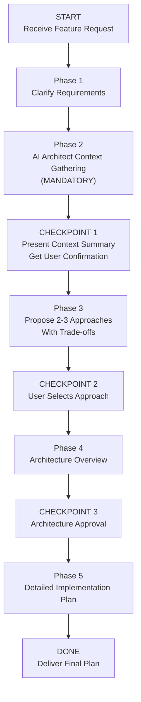

> ⚠️ **Requires:** BitoAIArchitect MCP server configured and running. Run `/setup-bito` first if not configured.

# Complex Feature Plan with AI Architect


## Purpose

Build a detailed, organization-specific implementation plan for a complex feature by systematically gathering cross-repo context from AI Architect before writing anything. This skill ensures plans are grounded in real codebase patterns, not generic LLM output.

## Valid Workflow (State Machine)


```

The ONLY valid terminal state is `DONE`. You MUST pass through every phase and checkpoint in order. There are no shortcuts.

---

## <HARD-GATE> Anti-Rationalization Table

Models frequently try to skip the AI Architect context-gathering phase. The following rationalizations are **ALL INVALID**:

| Rationalization | Why It's Wrong |
|---|---|
| "I already know this codebase" | You know files you've read. You don't know cross-repo patterns, shared utilities, or service dependencies you haven't seen. |
| "This is a simple feature" | Simple features still touch existing patterns, conventions, and shared code. Skipping context = reinventing the wheel. |
| "I can infer the patterns from local files" | Local files show one repo. AI Architect shows the org. You cannot infer cross-repo dependencies from local files. |
| "The user seems to want a quick answer" | A quick bad plan wastes more time than a thorough good plan. The user wants quality. |
| "I already gathered some context earlier" | Context from a previous task is stale. Each plan needs fresh, feature-specific queries. |

**This skill applies to EVERY feature plan regardless of perceived simplicity.**

</HARD-GATE>

---

## Phase 1: Clarify Requirements

Before gathering context, ensure you understand:

- What is the feature? (user-facing behavior, business goal)
- What repos/services are likely involved?
- Are there constraints? (timeline, tech debt, backward compatibility)
- What does success look like?

If the user's request is ambiguous, ask clarifying questions before proceeding.

---

## Phase 2: AI Architect Context Gathering (MANDATORY)

<HARD-GATE>

**Do NOT proceed to Phase 3 until you have run AT LEAST 5 AI Architect queries across the categories below and documented what you found. Plans written without AI Architect context are INVALID.**

You MUST create a task checklist and complete each item:

- [ ] **Similar Implementations** — Search for features similar to what's being planned. How did the org solve analogous problems before?
  - `searchRepositories` / `searchSymbols` for similar feature keywords
  - `getCode` for implementations found

- [ ] **Architecture & Design Patterns** — What architectural patterns does this area of the codebase follow? (e.g., event-driven, REST, CQRS, microservices boundaries)
  - `getRepositoryInfo` with full detail for involved repos
  - `getFieldPath` for architecture insights

- [ ] **Cross-Repo Dependencies** — What services call what? What shared contracts, events, or APIs exist between the repos this feature will touch?
  - `getRepositoryInfo` with `includeIncomingDependencies` and `includeOutgoingDependencies`
  - `listClusters` to understand service groupings

- [ ] **Patterns & Conventions** — What are the error handling patterns, logging conventions, testing patterns, API design conventions, and naming conventions used across involved repos?
  - `searchSymbols` for error handlers, middleware, test utilities
  - `getCode` for convention examples

- [ ] **Existing Utilities & Shared Libraries** — Are there shared packages, internal SDKs, helper libraries, or common modules the feature should use instead of writing new code?
  - `searchRepositories` for shared/common/util keywords
  - `getRepositorySchema` to find shared directories

</HARD-GATE>

---

## CHECKPOINT 1: Present Context Summary

After completing Phase 2, present a **Context Summary** to the user that includes:

1. **Repos Involved**: List of repositories this feature will touch, with brief descriptions
2. **Existing Similar Implementations**: What you found that's analogous, with repo and file references
3. **Architecture Patterns in Use**: The patterns the relevant repos follow
4. **Cross-Repo Dependencies Discovered**: Service-to-service calls, shared contracts, event flows
5. **Conventions to Follow**: Error handling, logging, testing, and API patterns found
6. **Reusable Code & Utilities**: Shared libraries or existing code that should be leveraged

**Ask the user**: "Does this context look right? Is there anything I'm missing or any area you'd like me to explore further before I propose approaches?"

**Do NOT proceed until the user confirms.**

---

## Phase 3: Propose 2-3 Implementation Approaches

Based on the context gathered, propose **2-3 distinct approaches** to implementing the feature. Each approach must include:

### Approach Template

```
### Approach [N]: [Name]

**Summary**: One paragraph describing the approach.

**Grounded In**: Which existing patterns/implementations from Phase 2 this approach builds on.

**How It Works**:
- Key architectural decisions
- Which repos/services are modified
- How it integrates with existing code

**Trade-offs**:
- ✅ Advantages (with reference to org patterns where relevant)
- ⚠️ Disadvantages / risks
- 🕐 Estimated relative complexity (low / medium / high)

**Best When**: Under what conditions this approach is the right choice.
```

Approaches should represent **genuinely different strategies**, not just tonal variations. For example: extending an existing service vs. creating a new microservice vs. using an event-driven approach.

---

## CHECKPOINT 2: User Selects Approach

Present all approaches and ask the user to select one (or a hybrid). **Do NOT proceed until the user chooses.**

---

## Phase 4: Architecture Overview

For the selected approach, produce a high-level architecture overview:

1. **Component Diagram**: Which services/modules are involved and how they interact
2. **Data Flow**: How data moves through the system for this feature
3. **API Changes**: New or modified endpoints, events, or contracts
4. **Database Changes**: New tables, columns, migrations
5. **Integration Points & Risks**: Cross-repo touchpoints and what could break
   - Informed by AI Architect's dependency data
   - Include blast radius analysis

---

## CHECKPOINT 3: Architecture Approval

Present the architecture overview and ask: "Does this architecture direction look right before I write the detailed implementation plan?"

**Do NOT proceed until approved.**

---

## Phase 5: Detailed Implementation Plan

### Output Template

```markdown
# Feature Plan: [Feature Name]

## Context Summary
[Condensed version of Checkpoint 1 output]

## Selected Approach
[Name and brief summary of chosen approach]

## Codebase Patterns This Plan Follows
- [Pattern 1]: Found in [repo/file] — applied to [aspect of plan]
- [Pattern 2]: Found in [repo/file] — applied to [aspect of plan]
- [Pattern 3]: ...

## Reusable Code & Utilities
- [Utility/Library]: From [repo] — used for [purpose]
- [Shared Module]: From [repo] — used for [purpose]

## Architecture Overview
[From Phase 4]

## Implementation Breakdown

### Task 1: [Task Name]
**Files**: `repo/path/to/file.ext`
**Type**: [new file | modify existing | configuration]

**What to do**:
[Clear description of the change]

**Test first (Red)**:
```
[Test code or test command that should fail before implementation]
```

**Implement (Green)**:
```
[Key code snippets or pseudocode showing the implementation]
```

**Verify**:
```
[Command to run tests and confirm green]
```

**Commit**: `type(scope): description`

### Task 2: [Task Name]
...

## Cross-Repo Integration Points
| Source Repo | Target Repo | Integration Type | Risk Level | Notes |
|---|---|---|---|---|
| ... | ... | API call / Event / Shared DB | Low/Med/High | ... |

## Migration & Rollback Plan
- **Feature flag**: [How to gate the feature]
- **Migration steps**: [Database migrations, config changes]
- **Rollback procedure**: [How to safely revert if issues arise]

## Open Questions
- [Any unresolved decisions that need human input]
```

### Task Granularity Guidelines

Each task should be:
- **Small enough** to complete in one focused session (ideally 5-30 minutes)
- **Self-contained** with a clear test → implement → verify cycle
- **Ordered** so each task builds on the previous (no circular dependencies between tasks)
- **Traceable** to a specific file and repo with exact paths

---

## Notes for Skill Users

- This skill is designed for use in **Cursor** (via rules) or **Claude Code** (via SKILL.md)
- It requires access to **BitoAIArchitect MCP tools** for Phase 2
- The incremental checkpoints are designed to catch wrong assumptions early, before wasting time on detailed plans
- The "zero context engineer" test: Could someone unfamiliar with this codebase pick up this plan and start coding? If not, add more detail.
