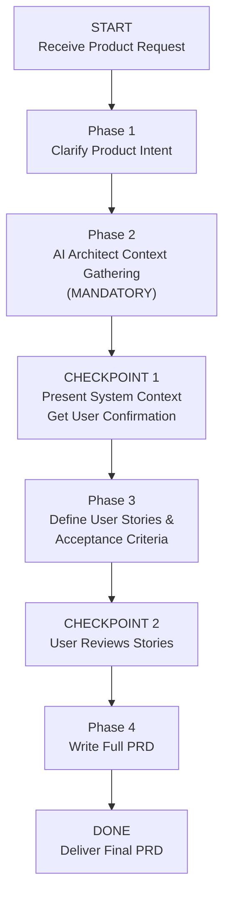

> ⚠️ **Requires:** BitoAIArchitect MCP server configured and running. Run `/setup-bito` first if not configured.

# Product Requirements Document (PRD) with AI Architect

## Purpose

Build a detailed, organization-specific PRD for a new feature or product change by systematically gathering context about existing user flows, feature interactions, and system capabilities from AI Architect before writing anything. This ensures the PRD is grounded in the real system — not a generic template disconnected from how the product actually works.

## Valid Workflow (State Machine)



The ONLY valid terminal state is `DONE`. You MUST pass through every phase and checkpoint in order. There are no shortcuts.

---

## <HARD-GATE> Anti-Rationalization Table

| Rationalization | Why It's Wrong |
|---|---|
| "I can write a PRD without knowing the existing system" | A PRD that ignores existing user flows, APIs, and capabilities will propose features that conflict with or duplicate what already exists. |
| "This is a new product area — no existing context needed" | Even greenfield features must integrate with existing auth, billing, APIs, data models, and deployment infrastructure. |
| "The user already described what they want" | The user described the *intent*. You need to understand the *system* to turn intent into feasible, non-conflicting requirements. |
| "I'll just write generic user stories" | Generic stories like "as a user I want to..." without system context produce requirements that are either impossible or redundant. |
| "Context gathering is the PM's job, not mine" | The value of this skill is that AI Architect gives you system context a PM would spend days gathering manually. Use it. |

**This skill applies to EVERY PRD regardless of perceived simplicity.**

</HARD-GATE>

---

## Phase 1: Clarify Product Intent

Before gathering context, ensure you understand:

- **What** is the feature or product change? (user-facing behavior)
- **Why** does it matter? (business goal, user pain point, opportunity)
- **Who** are the target users? (personas, roles, segments)
- **What does success look like?** (key metrics, outcomes)
- **Are there constraints?** (timeline, regulatory, backward compatibility, platform)

If the request is ambiguous, ask clarifying questions before proceeding.

---

## Phase 2: AI Architect Context Gathering (MANDATORY)

<HARD-GATE>

**Do NOT proceed to Phase 3 until you have run AT LEAST 5 AI Architect queries across the categories below and documented what you found. PRDs written without AI Architect context are INVALID.**

You MUST create a task checklist and complete each item:

- [ ] **Existing User Flows & Features** — What features exist today that are adjacent to or overlap with the proposed feature? How do users currently accomplish the task (or workaround) today?
  - `searchRepositories` for feature-area keywords
  - `searchSymbols` for relevant API endpoints, UI components, handlers
  - `getCode` for existing user-facing flows

- [ ] **System Capabilities & Constraints** — What does the current system support? What are its limitations? What APIs, data models, and services are available that the feature could leverage?
  - `getRepositoryInfo` with full detail for relevant repos
  - `getFieldPath` for API definitions, data models, schema info

- [ ] **Cross-Service Interactions** — How do the relevant services communicate? What shared contracts, events, or data flows exist?
  - `getRepositoryInfo` with `includeIncomingDependencies` and `includeOutgoingDependencies`
  - `listClusters` to understand service groupings

- [ ] **Authentication, Authorization & User Model** — How are users authenticated? What roles/permissions exist? How does the feature interact with the existing user model?
  - `searchRepositories` for auth, identity, or IAM services to discover relevant repos first
  - `searchSymbols` for auth middleware, role checks, permission models
  - `getRepositoryInfo` for auth-related services (with dependency data)

- [ ] **Existing UI Patterns & Design System** — What UI components, layouts, and interaction patterns are already in use? What design system or component library exists?
  - `searchRepositories` for UI libraries, shared components
  - `getRepositorySchema` for frontend repo structure

</HARD-GATE>

---

## CHECKPOINT 1: Present System Context

After completing Phase 2, present a **System Context Summary** to the user:

1. **Existing Related Features**: What the system already does in this area
2. **Available APIs & Services**: What the feature can build on
3. **User Model & Permissions**: How auth/roles work for this area
4. **UI Patterns Available**: Existing components and interaction patterns
5. **Cross-Service Dependencies**: Services that will be affected
6. **Constraints Discovered**: Technical limitations, data model constraints, or architectural boundaries

**Ask the user**: "Here's what I found about the current system. Does this match your understanding? Anything I should explore further before writing user stories?"

**Do NOT proceed until the user confirms.**

---

## Phase 3: Define User Stories & Acceptance Criteria

Based on Phase 1 intent + Phase 2 system context, write user stories with acceptance criteria. Each story must be:

- **Grounded**: Reference specific existing APIs, services, or UI components it builds on
- **Feasible**: Not contradicting system constraints discovered in Phase 2
- **Non-duplicative**: Not recreating functionality that already exists

### Story Template

```
### Story [N]: [Title]

**As a** [role/persona],
**I want to** [action],
**So that** [outcome].

**Builds On**: [Existing service/API/component from Phase 2 context]

**Acceptance Criteria**:
- [ ] Given [precondition], when [action], then [result]
- [ ] Given [precondition], when [action], then [result]
- [ ] ...

**Out of Scope**: [Explicitly list what this story does NOT cover]
```

---

## CHECKPOINT 2: User Reviews Stories

Present all user stories and ask: "Do these stories capture the right scope? Should any be added, removed, or modified?"

**Do NOT proceed until approved.**

---

## Phase 4: Write Full PRD

### Output Template

```markdown
# PRD: [Feature Name]

## 1. Overview
- **Feature**: [One-line description]
- **Business Goal**: [Why this matters]
- **Target Users**: [Who this is for]
- **Success Metrics**: [How we measure success]

## 2. System Context
[Condensed version of Checkpoint 1 — what exists today that this feature builds on or changes]

### Existing Capabilities Leveraged
- [Service/API/Component]: [How the feature uses it]
- ...

### New Capabilities Required
- [What needs to be built that doesn't exist today]
- ...

## 3. User Stories & Acceptance Criteria
[From Phase 3, approved by user]

## 4. Functional Requirements

### 4.1 Core Functionality
[Detailed requirements organized by area, referencing specific services/APIs]

### 4.2 Edge Cases & Error Handling
[What happens when things go wrong — informed by existing error patterns from AI Architect]

### 4.3 Permissions & Access Control
[Who can do what — grounded in existing auth model]

## 5. Non-Functional Requirements
- **Performance**: [Targets, informed by existing system benchmarks if available]
- **Scalability**: [Considerations based on current system architecture]
- **Security**: [Requirements, building on existing security patterns]
- **Accessibility**: [Standards to meet]

## 6. Dependencies & Integration Points

| Dependency | Type | Owner/Repo | Risk | Notes |
|---|---|---|---|---|
| ... | API / Service / Data / UI | ... | Low/Med/High | ... |

## 7. UX & Design Notes
- [Key interaction patterns, referencing existing UI conventions]
- [Wireframe descriptions or references]
- [Existing components to reuse vs. new ones needed]

## 8. Rollout & Feature Flagging
- **Feature flag strategy**: [How to gate the feature]
- **Rollout phases**: [Who gets it first]
- **Rollback plan**: [How to safely disable]

## 9. Open Questions
- [Unresolved decisions requiring stakeholder input]

## 10. Out of Scope
- [What this PRD explicitly does NOT cover]
```

---

## Notes

- This skill emphasizes understanding **existing user flows and system capabilities** before writing requirements — the shift from generic to org-specific PRDs
- The PRD should be readable by PMs, designers, and engineers — avoid jargon-heavy prose but include specific technical references where they clarify scope
- If AI Architect reveals that the proposed feature significantly overlaps with an existing feature, surface this to the user immediately rather than burying it in the document
