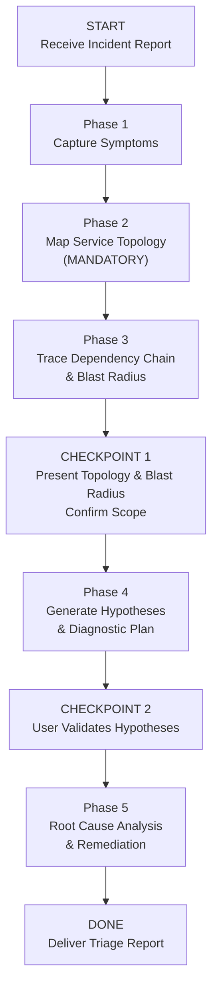

> ⚠️ **Requires:** BitoAIArchitect MCP server configured and running. Run `/setup-bito` first if not configured.

# Production Issue Triage with AI Architect

## Purpose

Systematically diagnose and triage a production issue by leveraging AI Architect to understand service topology, trace dependency chains, identify blast radius, and surface root cause candidates. This skill turns a reactive "grep logs and hope" approach into a structured diagnostic workflow grounded in actual system architecture.

**This skill is architecturally different from the planning skills.** Feature Plan, PRD, and TRD are *generative* workflows (build something new). Production Triage is a *diagnostic* workflow (understand something broken). The phases are oriented around narrowing down the problem, not building up a solution.

## Valid Workflow (State Machine)



The ONLY valid terminal state is `DONE`. You MUST pass through every phase and checkpoint in order. There are no shortcuts.

---

## <HARD-GATE> Anti-Rationalization Table

| Rationalization | Why It's Wrong |
|---|---|
| "The error message tells me the root cause" | Error messages show *symptoms*, not causes. A database timeout in Service A might be caused by a memory leak in Service B that shares the connection pool. |
| "I know which service is broken from the logs" | You know which service is *failing*. The root cause may be upstream, downstream, or in shared infrastructure. You need the dependency chain. |
| "This is a simple bug — no need for topology mapping" | Simple bugs in one service often have cascading effects across dependent services. You need blast radius even for "simple" issues. |
| "I'll just look at the service that's alerting" | The alerting service is the *victim*, not necessarily the *cause*. AI Architect's dependency mapping reveals the actual causal chain. |
| "Time is critical — skip the context gathering" | 10 minutes of structured diagnosis saves hours of random debugging. Skipping topology mapping leads to fixing symptoms, not causes. |

**This skill applies to EVERY production issue regardless of perceived severity or simplicity.**

</HARD-GATE>

---

## Phase 1: Capture Symptoms

Gather all available information about the incident:

- **What is broken?** (User-facing impact: errors, slowness, data loss, incorrect behavior)
- **When did it start?** (Timestamp, gradual vs. sudden onset)
- **What changed recently?** (Deployments, config changes, traffic spikes, infrastructure changes)
- **Error messages / logs**: (Exact error text, stack traces, log snippets)
- **Affected scope**: (All users vs. subset, all regions vs. specific, specific endpoints)
- **Severity**: (P0-P4, business impact)

Structure symptoms as:

```
### Symptom Summary
- **Impact**: [What users are experiencing]
- **Onset**: [When it started, sudden vs. gradual]
- **Scope**: [Who/what is affected]
- **Error Signals**: [Error messages, HTTP status codes, log entries]
- **Recent Changes**: [Deployments, config changes in the window]
```

If the user hasn't provided enough symptom data, ask clarifying questions before proceeding.

---

## Phase 2: Map Service Topology (MANDATORY)

<HARD-GATE>

**Do NOT proceed to Phase 3 until you have mapped the service topology around the affected area using AT LEAST 4 AI Architect queries. Triage without topology mapping is INVALID.**

You MUST create a task checklist and complete each item:

- [ ] **Identify the Affected Service(s)** — Which service(s) are directly exhibiting the symptoms?
  - `searchRepositories` for service keywords from error messages/logs
  - `getRepositoryInfo` with full detail for the affected service

- [ ] **Map Upstream Dependencies** — What services call the affected service? If the affected service is degraded, who is impacted?
  - `getRepositoryInfo` with `includeIncomingDependencies` for the affected service
  - `listClusters` to understand the service's cluster membership

- [ ] **Map Downstream Dependencies** — What does the affected service depend on? If a dependency is the root cause, this is how you find it.
  - `getRepositoryInfo` with `includeOutgoingDependencies` for the affected service
  - Repeat for key downstream services to build the full chain

- [ ] **Identify Shared Infrastructure** — What databases, caches, message queues, or shared services do the involved services share? Shared resources are common root causes.
  - `searchRepositories` for database, cache, queue, and infrastructure repos
  - `getRepositoryInfo` for shared infrastructure components

</HARD-GATE>

---

## Phase 3: Trace Dependency Chain & Blast Radius

Using the topology from Phase 2, build:

### Dependency Chain
Trace the path from the symptom back to potential root causes:

```
[User-Facing Symptom]
  → [Service A: exhibiting errors]
    → [Service B: upstream caller, also affected]
    → [Service C: downstream dependency]
      → [Database D: shared resource, potential bottleneck]
      → [Service E: another downstream dependency]
```

### Blast Radius
Map every service and system affected by this incident:

```
### Blast Radius

**Directly Affected**:
- [Service A]: [symptom]
- [Service B]: [symptom]

**Indirectly Affected** (dependent on affected services):
- [Service C]: [potential impact]
- [Service D]: [potential impact]

**Shared Infrastructure at Risk**:
- [Database X]: [used by N services]
- [Cache Y]: [used by N services]

**Unaffected** (confirmed isolated):
- [Service E]: [why it's isolated]
```

---

## CHECKPOINT 1: Present Topology & Blast Radius

Present the dependency chain and blast radius to the user.

**Ask the user**: "Here's the service topology and blast radius I mapped. Does this match what you're seeing? Are there any services I'm missing or any additional symptoms?"

**Do NOT proceed until confirmed.**

---

## Phase 4: Generate Hypotheses & Diagnostic Plan

Based on symptoms (Phase 1) + topology (Phase 2-3), generate ranked hypotheses:

### Hypothesis Template

```
### Hypothesis [N]: [One-line description]

**Likelihood**: High / Medium / Low
**Reasoning**: [Why this could be the cause, based on symptoms + topology]
**Evidence For**: [What symptoms support this]
**Evidence Against**: [What symptoms contradict this]

**Diagnostic Steps**:
1. [Specific check to confirm or rule out]
   - Where to look: [service, log, metric, dashboard]
   - What to look for: [specific pattern, value, or condition]
2. [Next check if step 1 is inconclusive]
   - ...

**If Confirmed — Immediate Mitigation**:
- [What to do RIGHT NOW to stop the bleeding]
```

Generate **at least 3 hypotheses**, ranked by likelihood. Each must have concrete diagnostic steps — not vague suggestions like "check the logs."

Use AI Architect to inform hypotheses:

- [ ] `searchSymbols` for error handling code in affected services — understand what error paths exist
- [ ] `getCode` for retry logic, circuit breakers, timeout configs — understand resilience behavior
- [ ] `searchSymbols` for recent migration files or config changes — correlate with onset time

---

## CHECKPOINT 2: User Validates Hypotheses

Present hypotheses and diagnostic plan. Ask: "Do these hypotheses make sense? Should I prioritize any differently? Do you have additional data that confirms or rules out any of these?"

**Do NOT proceed until the user provides feedback.**

---

## Phase 5: Root Cause Analysis & Remediation

Based on user feedback and diagnostic results, produce the final triage report.

### Output Template

```markdown
# Production Triage Report: [Incident Title]

## 1. Incident Summary
- **Severity**: [P0-P4]
- **Impact**: [User-facing impact description]
- **Duration**: [Start time → resolution time or ongoing]
- **Affected Services**: [List]
- **Affected Users/Scope**: [Who was impacted]

## 2. Symptom Timeline
| Time | Event |
|---|---|
| [timestamp] | [First symptom observed] |
| [timestamp] | [Escalation / additional symptoms] |
| [timestamp] | [Diagnosis began] |
| [timestamp] | [Root cause identified] |
| [timestamp] | [Mitigation applied] |

## 3. Service Topology & Blast Radius
[From Phase 3 — dependency chain and blast radius map]

## 4. Root Cause Analysis

### Root Cause
[Clear, specific description of what went wrong and why]

### Causal Chain
```
[Trigger event]
  → [First effect]
    → [Cascading effect]
      → [User-facing symptom]
```

### Contributing Factors
- [Factor 1]: [How it contributed]
- [Factor 2]: [How it contributed]

### Why It Wasn't Caught Earlier
- [Gap in monitoring / testing / review that allowed this]

## 5. Hypotheses Evaluated

| Hypothesis | Verdict | Key Evidence |
|---|---|---|
| [Hypothesis 1] | ✅ Confirmed / ❌ Ruled Out | [What proved or disproved it] |
| [Hypothesis 2] | ✅ Confirmed / ❌ Ruled Out | [What proved or disproved it] |
| ... | ... | ... |

## 6. Immediate Mitigation Applied
- [What was done to stop the incident]
- [Temporary workarounds in place]

## 7. Permanent Fix Recommendations

### Short-Term (This Sprint)
| Fix | Repo | Description | Effort |
|---|---|---|---|
| ... | ... | ... | S/M/L |

### Medium-Term (Next 2-4 Weeks)
| Fix | Repo | Description | Effort |
|---|---|---|---|
| ... | ... | ... | S/M/L |

### Long-Term (Architecture Improvements)
| Fix | Repo(s) | Description | Effort |
|---|---|---|---|
| ... | ... | ... | S/M/L |

## 8. Prevention Measures

### Monitoring Gaps to Close
- [New alert / dashboard / metric to add]

### Testing Gaps to Close
- [New test scenarios to add]

### Process Gaps to Close
- [Deployment checks, review steps, runbook updates]

## 9. Cross-Repo Impact of Fixes

| Repo | Change Required | Risk | Notes |
|---|---|---|---|
| ... | ... | Low/Med/High | ... |

## 10. Open Questions
- [Unresolved items needing further investigation]
```

---

## Notes

- **Speed vs. thoroughness**: In a live P0, you may need to compress Phases 2-3 into a rapid topology check. But even under time pressure, do NOT skip the AI Architect queries — they take seconds and save hours of blind debugging.
- **This skill is diagnostic, not generative.** The output is a triage report, not a plan. The goal is to understand what happened and recommend fixes, not to design a solution from scratch.
- **Blast radius is the key insight.** The #1 thing AI Architect provides that manual debugging doesn't is the ability to immediately see which other services are affected by an issue in one service. This is the cross-repo value proposition.
- **Hypotheses should be falsifiable.** Each hypothesis must have a concrete diagnostic step that can confirm or rule it out. Vague hypotheses like "something is wrong with the database" are not acceptable.
- If the incident involves a recent deployment, use AI Architect to pull the relevant repo's recent changes and correlate with the symptom timeline.
