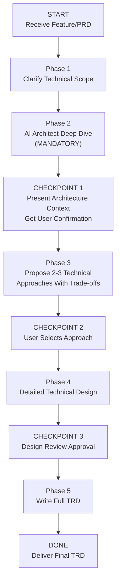

> ⚠️ **Requires:** BitoAIArchitect MCP server configured and running. Run `/setup-bito` first if not configured.

# Technical Requirements Document (TRD) with AI Architect

## Purpose

Build a detailed, organization-specific TRD (Technical Requirements Document / Technical Design Document) for a feature by systematically gathering system design context, infrastructure patterns, capacity data, and architectural conventions from AI Architect. The TRD translates a PRD or feature request into a concrete technical design that an engineering team can implement — grounded in the organization's actual architecture, not generic design patterns.

## Valid Workflow (State Machine)



The ONLY valid terminal state is `DONE`. You MUST pass through every phase and checkpoint in order. There are no shortcuts.

---

## <HARD-GATE> Anti-Rationalization Table

| Rationalization | Why It's Wrong |
|---|---|
| "I can design this system from the requirements alone" | Without knowing the existing architecture, you'll propose designs that conflict with how the system is actually built, deployed, and operated. |
| "This is a standalone service — no existing context needed" | No service is standalone. It needs auth, logging, monitoring, deployment pipelines, and inter-service communication — all of which have existing patterns. |
| "I know common design patterns, that's enough" | The org has *specific* patterns — specific ORMs, specific message queues, specific API conventions. Generic patterns create inconsistency. |
| "The PRD already describes the technical approach" | PRDs describe *what*, not *how*. The TRD must map requirements to the actual infrastructure, data layer, and service topology. |
| "I'll figure out the infrastructure details during implementation" | Infrastructure decisions (database choice, caching strategy, async vs sync) are architectural — deferring them to implementation causes rework. |

**This skill applies to EVERY TRD regardless of perceived simplicity.**

</HARD-GATE>

---

## Phase 1: Clarify Technical Scope

Before gathering context, ensure you understand:

- **What feature/PRD** is this TRD for? (Get or reference the PRD if available)
- **Which repos/services** are likely involved?
- **What are the key technical challenges?** (scale, latency, data consistency, migration)
- **Are there hard constraints?** (must use specific tech, must not change certain APIs, deployment target)
- **What's the expected scale?** (users, requests/sec, data volume)

If the request is ambiguous, ask clarifying questions before proceeding.

---

## Phase 2: AI Architect Deep Dive (MANDATORY)

<HARD-GATE>

**Do NOT proceed to Phase 3 until you have run AT LEAST 7 AI Architect queries across the categories below and documented what you found. TRDs written without AI Architect context are INVALID.**

You MUST create a task checklist and complete each item:

- [ ] **Service Architecture & Topology** — What is the current service topology? How do the involved services communicate (REST, gRPC, events, shared DB)?
  - `getRepositoryInfo` with `includeIncomingDependencies` and `includeOutgoingDependencies` for each involved repo
  - `listClusters` to understand service groupings and boundaries

- [ ] **Data Layer & Storage Patterns** — What databases, caches, and storage systems are used? What are the data models, schemas, and access patterns?
  - `searchSymbols` for models, schemas, migrations, repositories/DAOs
  - `getCode` for database configuration, ORM setup, migration files
  - `getFieldPath` for data model documentation

- [ ] **API Design Conventions** — How are APIs currently designed? What conventions exist for versioning, authentication, error responses, pagination?
  - `searchSymbols` for API routes, controllers, middleware
  - `getCode` for API definition files, OpenAPI specs, request/response types

- [ ] **Infrastructure & Deployment Patterns** — How are services deployed? What CI/CD pipelines, container orchestration, and infrastructure-as-code patterns exist?
  - `searchRepositories` for infra/devops repos
  - `getRepositorySchema` for deployment configuration directories

- [ ] **Observability & Operations** — How are services monitored? What logging, metrics, alerting, and tracing patterns are in place?
  - `searchSymbols` for logging setup, metrics emission, health checks
  - `getCode` for monitoring configuration

- [ ] **Security Patterns** — How is authentication/authorization handled at the service level? What security middleware, token validation, or encryption patterns exist?
  - `searchSymbols` for auth middleware, token validation, encryption utilities
  - `getRepositoryInfo` for auth-related services

- [ ] **Similar Technical Implementations** — Has the org built something architecturally similar before? What can be learned from existing designs?
  - `searchRepositories` for similar feature keywords
  - `getCode` for analogous implementations

</HARD-GATE>

---

## CHECKPOINT 1: Present Architecture Context

After completing Phase 2, present an **Architecture Context Summary**:

1. **Service Topology**: How the involved services are connected (with dependency directions)
2. **Data Layer**: Databases, caches, and storage in use; relevant schemas
3. **API Conventions**: How APIs are currently designed in this part of the system
4. **Deployment Model**: How services are deployed, scaled, and operated
5. **Observability Stack**: Logging, metrics, and alerting patterns
6. **Security Model**: How auth/authz works at the service level
7. **Analogous Implementations**: Similar past designs and what they teach us

**Ask the user**: "Here's the architecture context I gathered. Does this look right? Any services or infrastructure I'm missing?"

**Do NOT proceed until the user confirms.**

---

## Phase 3: Propose 2-3 Technical Approaches

Based on context gathered, propose **2-3 distinct technical approaches**:

### Approach Template

```
### Approach [N]: [Name]

**Summary**: One paragraph describing the technical strategy.

**Grounded In**: Which existing architectural patterns/implementations this follows.

**Architecture**:
- Service changes (new services, modified services)
- Data model changes (new tables, schema migrations)
- API changes (new endpoints, modified contracts)
- Infrastructure changes (new resources, scaling adjustments)

**Trade-offs**:
- ✅ Advantages (with reference to org patterns)
- ⚠️ Disadvantages / risks
- 📊 Scalability characteristics
- 🕐 Estimated implementation effort (low / medium / high)
- 🔄 Migration complexity (if applicable)

**Best When**: Under what conditions this approach is the right choice.
```

---

## CHECKPOINT 2: User Selects Approach

Present all approaches. **Do NOT proceed until the user chooses.**

---

## Phase 4: Detailed Technical Design

For the selected approach, produce a detailed design covering:

1. **System Design Diagram**: Components, data flow, and interactions
2. **API Specifications**: Endpoint definitions, request/response schemas, error codes
3. **Data Model Design**: Table schemas, relationships, indexes, migration plan
4. **Service Interaction Design**: Sequence diagrams for key flows
5. **Caching Strategy**: What to cache, TTLs, invalidation
6. **Error Handling & Resilience**: Retry policies, circuit breakers, fallback behavior
7. **Security Design**: Auth flow for new endpoints, data access controls

---

## CHECKPOINT 3: Design Review Approval

Present the detailed design. Ask: "Does this technical design look right before I write the full TRD?"

**Do NOT proceed until approved.**

---

## Phase 5: Write Full TRD

### Output Template

```markdown
# TRD: [Feature Name]

## 1. Overview
- **Feature**: [One-line description]
- **PRD Reference**: [Link or reference to PRD if available]
- **Scope**: [Services/repos affected]
- **Estimated Effort**: [T-shirt size with rationale]

## 2. Architecture Context
[Condensed version of Checkpoint 1]

### Existing Patterns This Design Follows
- [Pattern]: Found in [repo/service] — applied to [aspect of design]
- ...

## 3. Selected Technical Approach
[Name and summary of chosen approach, with rejected alternatives noted]

## 4. System Design

### 4.1 Component Diagram
[ASCII diagram or description of components and interactions]

### 4.2 Data Flow
[How data moves through the system for key user actions]

### 4.3 Sequence Diagrams
[Key interaction flows between services]

## 5. API Specification

### New Endpoints

| Method | Path | Description | Auth Required |
|---|---|---|---|
| ... | ... | ... | ... |

### Request/Response Schemas
[For each new or modified endpoint]

### Error Codes
[Following existing org conventions]

## 6. Data Model

### New Tables/Collections

| Table | Column | Type | Constraints | Notes |
|---|---|---|---|---|
| ... | ... | ... | ... | ... |

### Migrations Required
[Ordered list of migration steps]

### Indexes
[Performance-critical indexes with rationale]

## 7. Infrastructure & Deployment

### New Resources Required
- [Database / Cache / Queue / Storage additions]

### Scaling Considerations
- Expected load: [requests/sec, data growth]
- Scaling strategy: [horizontal/vertical, auto-scaling rules]

### Deployment Plan
- [Deployment order, feature flags, canary strategy]
- [Following existing CI/CD patterns from org]

## 8. Observability

### Logging
- [Key log events, following existing logging conventions]

### Metrics
- [New metrics to emit, dashboards to create]

### Alerting
- [Alert conditions and thresholds]

### Health Checks
- [New health check endpoints or criteria]

## 9. Security

### Authentication & Authorization
- [How new endpoints are secured, following existing auth patterns]

### Data Protection
- [Encryption at rest/transit, PII handling]

## 10. Error Handling & Resilience
- [Retry policies, circuit breakers, timeouts]
- [Graceful degradation strategy]
- [Following existing resilience patterns from org]

## 11. Testing Strategy
- **Unit tests**: [Key areas to cover]
- **Integration tests**: [Cross-service test scenarios]
- **Load tests**: [Performance targets and test plan]
- [Following existing testing patterns from org]

## 12. Migration & Rollback Plan
- **Migration steps**: [Ordered, with rollback for each]
- **Feature flag**: [How to gate the feature]
- **Rollback procedure**: [Step-by-step revert plan]
- **Data migration**: [If applicable, with zero-downtime strategy]

## 13. Cross-Repo Impact

| Repo | Change Type | Risk | Owner | Notes |
|---|---|---|---|---|
| ... | New code / Config / Schema | Low/Med/High | ... | ... |

## 14. Open Questions
- [Unresolved technical decisions]

## 15. Dependencies & Blockers
- [External team dependencies, infrastructure requests, etc.]
```

---

## Notes

- The TRD is the **bridge between PRD and implementation**. It should be specific enough that an engineer can start coding from it.
- The emphasis on AI Architect in Phase 2 is heavier than the Feature Plan or PRD skills because the TRD needs the deepest technical context: schemas, deployment configs, API conventions, infrastructure patterns.
- Always reference existing org patterns — the goal is consistency, not novelty.
- If AI Architect reveals that the proposed design would require changes to a critical shared service, flag this prominently as a risk.
